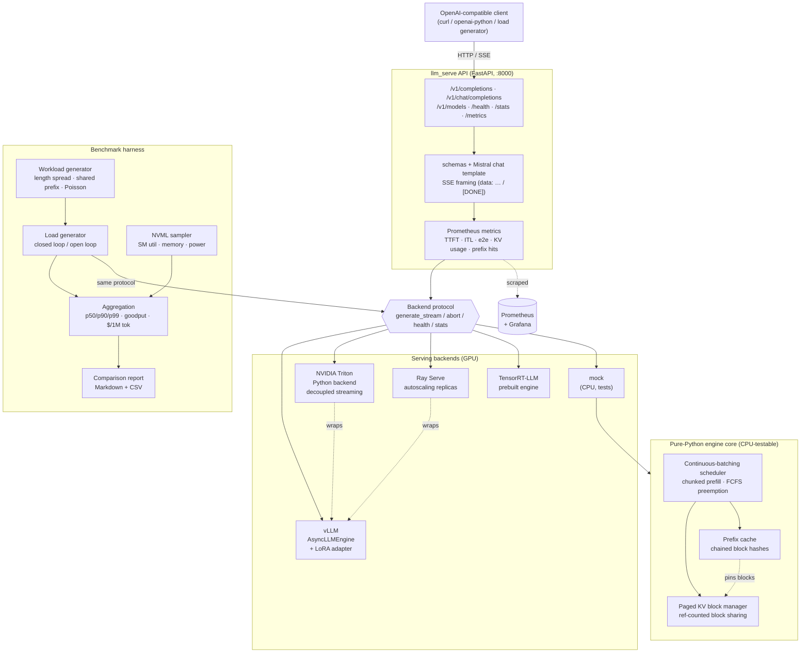
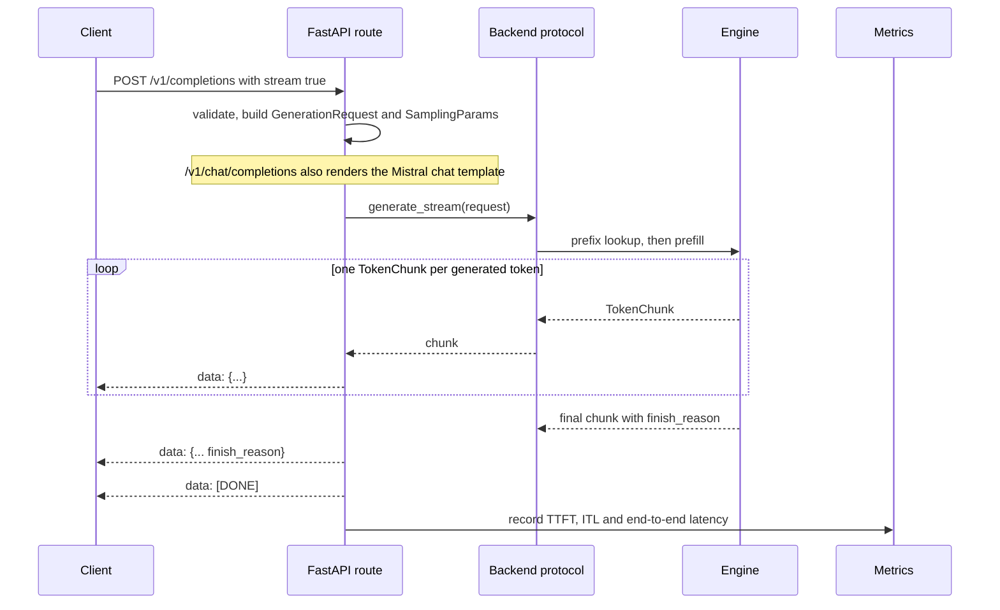
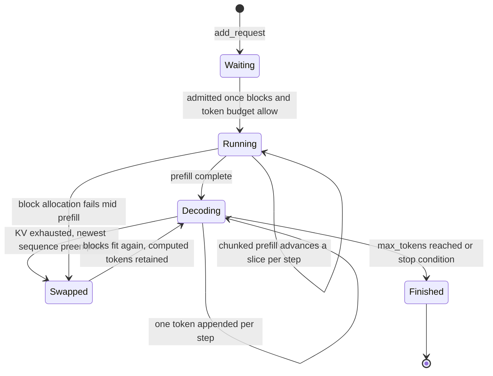
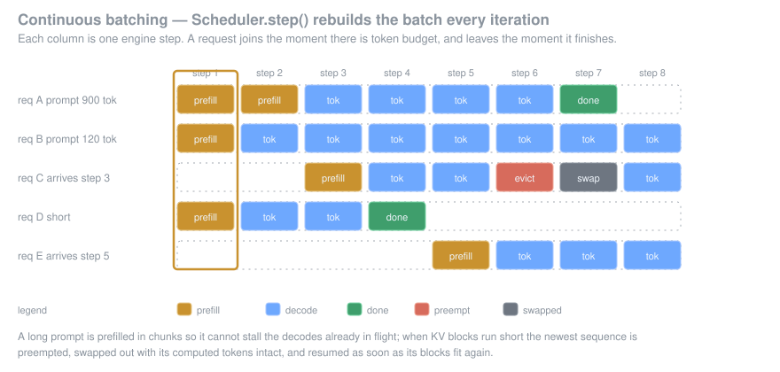

# llm_serve — Multi-Backend LLM Inference Serving

Serves a fine-tuned **Mistral 7B (QLoRA)** behind four production inference stacks —
**vLLM**, **NVIDIA Triton**, **Ray Serve** and **TensorRT-LLM** — through one
**OpenAI-compatible API** with SSE token streaming, then benchmarks all four on the
same workload and publishes a comparison report.

The point of the project is the comparison. Every backend sits behind one `Backend`
protocol, so the API layer, the load generator and the metrics are identical across
runs; the only variable is the engine. That makes the numbers — tokens/s, req/s,
time-to-first-token, inter-token latency, GPU utilization, $/1M tokens — actually
comparable.

- **Continuous batching**: the batch is rebuilt every decode step, so a finished
  sequence frees its slot immediately instead of at the end of a batch.
- **Paged KV cache with prefix reuse**: fixed-size KV blocks, reference-counted and
  shared, so a repeated system prompt is prefilled once and reused by every request
  that shares it.
- **Token streaming**: server-sent events with exact OpenAI chunk objects, so
  existing clients work unchanged.
- **TensorRT-LLM export**: ahead-of-time compiled engines (fp8/int4-AWQ) to cut
  latency and serving cost.

## Architecture



The request path for one streamed completion:



Inside the engine core, one request moves through the scheduler like this:



Because the batch is rebuilt on every `step()`, arrivals and departures do not
have to line up with each other:




## Project structure

```
llm_serve/
├── llm_serve/
│   ├── types.py                 # SamplingParams, GenerationRequest, TokenChunk, results
│   ├── config.py                # YAML < env < CLI layering, typed + validated
│   ├── server.py                # `python -m llm_serve.server` entry point
│   ├── backends/
│   │   ├── base.py              # Backend protocol + lazy name→class registry
│   │   ├── mock.py              # deterministic CPU engine (tests, dry runs)
│   │   ├── vllm_backend.py      # AsyncLLMEngine + QLoRA LoRARequest
│   │   ├── triton_backend.py    # gRPC streaming client for the Python backend
│   │   ├── ray_backend.py       # HTTP/SSE client for the Serve deployment
│   │   └── trtllm_backend.py    # prebuilt TensorRT-LLM engine
│   ├── engine/
│   │   ├── block_manager.py     # paged KV blocks, ref counting, watermark
│   │   ├── prefix_cache.py      # chained block hashes, LRU, pinning
│   │   ├── scheduler.py         # continuous batching, chunked prefill, preemption
│   │   └── stats.py             # rolling engine statistics
│   ├── api/
│   │   ├── app.py               # FastAPI app (FastAPI imported lazily)
│   │   ├── openai_schemas.py    # request parsing + response/chunk builders
│   │   ├── sse.py               # SSE framing and parsing
│   │   └── chat_template.py     # Mistral [INST] … [/INST] rendering
│   ├── metrics/
│   │   ├── math.py              # percentiles, histogram quantiles, goodput
│   │   └── registry.py          # Prometheus text exposition + the serving metric set
│   └── bench/
│       ├── workload.py          # length distributions, shared prefix, Poisson arrivals
│       ├── loadgen.py           # async driver, warmup, per-token timing
│       ├── aggregate.py         # percentiles, throughput, SLO, cost
│       ├── gpu_monitor.py       # NVML sampler (no-op without a GPU)
│       └── report.py            # Markdown + CSV comparison report
├── deploy/
│   ├── triton/model_repository/mistral7b/{config.pbtxt,1/model.py}
│   ├── ray/serve_app.py
│   ├── Dockerfile.triton · Dockerfile.ray · docker-compose.yml · prometheus.yml
├── scripts/
│   ├── run_benchmark.py         # one backend, optional concurrency ladder
│   ├── compare_backends.py      # results/*.json → comparison.md + .csv
│   └── export_trtllm.py         # merge QLoRA → convert → trtllm-build
├── configs/{serving.yaml,bench.yaml}
├── tests/                       # 270 CPU-only unit tests
└── implementation_plan.md
```

## Requirements

**Serving any real backend needs an NVIDIA GPU.**

| | Minimum | Notes |
|---|---|---|
| GPU | 1× 24 GB (L4 / A10 / 4090) for a 4-bit Mistral 7B | 1× A100 80 GB for bf16 + long context |
| CUDA | 12.1+ | matching NVIDIA driver |
| Python | 3.10+ | 3.11 for the Ray image |
| Docker | with the NVIDIA container toolkit | for the Triton and Ray profiles |
| Disk | ~30 GB | weights + HF cache + TensorRT engines |

TensorRT-LLM engines are architecture-specific: an engine built on an A100 will not
load on an L4, and rebuilding is required whenever `max_batch_size` or
`max_seq_len` changes.

The `mock` backend needs none of this and runs anywhere Python does.

## Install

```bash
pip install -r requirements.txt          # core: pyyaml, fastapi, uvicorn, httpx, prometheus-client
```

Then uncomment the backend you intend to run in `requirements.txt`:

```bash
pip install "vllm>=0.6.0"                # vLLM (and the engine inside Triton/Ray)
pip install "tritonclient[all]>=2.48"    # Triton client
pip install "ray[serve]>=2.35"           # Ray Serve
pip install nvidia-ml-py                 # GPU utilization sampling in benchmarks
# TensorRT-LLM: use the NGC container, a pip install is fragile
```

## Run

### Dry run — no GPU, no weights

```bash
python -m llm_serve.server --print-config --set backend.kind=vllm    # resolve config only
python -m llm_serve.server --backend mock --port 8000                # serve the mock engine
curl -N localhost:8000/v1/completions \
  -d '{"prompt":"hello","max_tokens":16,"stream":true}'
```

### vLLM (in-process)

```bash
python -m llm_serve.server \
  --config configs/serving.yaml \
  --backend vllm \
  --set model.lora_adapter=/models/mistral7b-qlora \
  --set backend.gpu_memory_utilization=0.90
```

```bash
curl localhost:8000/v1/chat/completions -H 'content-type: application/json' -d '{
  "model": "mistral-7b-qlora",
  "messages": [{"role":"system","content":"Be terse."},
               {"role":"user","content":"Explain paged attention."}],
  "max_tokens": 256, "stream": true
}'
```

`/health`, `/stats` and `/metrics` are live on the same port; `/metrics` is
Prometheus text exposition.

### Triton

```bash
docker compose -f deploy/docker-compose.yml --profile triton up --build
# gRPC on :8101, Triton's own metrics on :8102

python -m llm_serve.server --backend triton --set backend.endpoint=localhost:8101
```

### Ray Serve

```bash
docker compose -f deploy/docker-compose.yml --profile ray up --build
# Serve HTTP on :8200, Ray dashboard on :8265

python -m llm_serve.server --backend ray --set backend.endpoint=http://localhost:8200
```

Replica autoscaling is set through `LLM_SERVE_MIN_REPLICAS` / `LLM_SERVE_MAX_REPLICAS`
/ `LLM_SERVE_TARGET_ONGOING`.

### TensorRT-LLM

```bash
# 1. inspect the build plan without running it
python scripts/export_trtllm.py --dry-run --lora-adapter /models/mistral7b-qlora

# 2. build (inside the TensorRT-LLM / NGC container, on the target GPU)
python scripts/export_trtllm.py \
  --lora-adapter /models/mistral7b-qlora \
  --quantization fp8 \
  --max-batch-size 64 --max-input-len 4096 --max-seq-len 8192 \
  --engine-dir artifacts/trtllm-engine

# 3. serve it
python -m llm_serve.server --backend trtllm --set backend.engine_dir=artifacts/trtllm-engine
```

Use `--quantization int4_awq` on Ampere; `fp8` needs Hopper (SM90+).

### Monitoring

```bash
docker compose -f deploy/docker-compose.yml --profile monitoring up -d
# Prometheus :9090, Grafana :3000
```

## Benchmark

```bash
# one backend, a concurrency ladder
python scripts/run_benchmark.py --config configs/bench.yaml \
  --backend vllm --concurrency 1 --concurrency 8 --concurrency 32 --concurrency 128 \
  --num-requests 500 --input-len 512 --output-len 128

# same for the others
python scripts/run_benchmark.py --backend triton --endpoint localhost:8101 --concurrency 32
python scripts/run_benchmark.py --backend ray    --endpoint http://localhost:8200 --concurrency 32
python scripts/run_benchmark.py --backend trtllm --engine-dir artifacts/trtllm-engine --concurrency 32

# build the report
python scripts/compare_backends.py 'benchmarks/results/*.json' \
  --baseline vllm --output benchmarks/comparison.md --csv benchmarks/comparison.csv
```

`--shared-prefix-len 512` makes every request share a system prompt, which is what
surfaces the prefix-cache win; `--request-rate 20` switches from a closed loop
(capacity) to an open loop at fixed offered load (queueing behaviour).

What gets measured, and how:

| Metric | Definition |
|---|---|
| **TTFT** | Arrival → first streamed token, so queueing is included. |
| **ITL** | Gap between consecutive tokens, pooled across all requests. |
| **Output tok/s** | Generated tokens ÷ wall-clock run window. |
| **Req/s** | Completed requests ÷ run window. |
| **SLO attainment** | Fraction meeting *both* the TTFT and mean-ITL budgets. |
| **Goodput** | Requests/s that met the SLO — a server can post good throughput while missing latency on a third of requests. |
| **GPU util** | Mean/max SM utilization sampled from NVML during the run. |
| **$/1M tokens** | Derived from output throughput and the GPU hourly price. |

Output-length variance is removed with `ignore_eos` so an engine cannot look faster
by generating less, and warmup requests are discarded so CUDA-graph capture and the
first cold prefill do not land in the measured window.

## Test

Everything below runs on CPU with no GPU, no model weights and no network.

```bash
python -m unittest discover -s tests -t .     # 270 tests, <1s
python -m compileall -q llm_serve scripts deploy
```

The suite covers:

| Area | What is asserted |
|---|---|
| `test_block_manager` | Block math, watermark admission, ref-counted sharing, double-free detection. |
| `test_prefix_cache` | Chained hashing (a matching second block with a different first block must *not* hit), longest-prefix matching, LRU eviction releasing pins. |
| `test_scheduler` | Chunked prefill splitting, token budget and `max_num_seqs` caps, preemption under KV pressure, FCFS progress guarantee, prefix reuse shrinking the second prefill. |
| `test_metrics` | Percentiles against known values, Prometheus histogram-quantile interpolation, exposition-format output. |
| `test_sse` / `test_openai_schemas` | Exact OpenAI chunk shapes, role-only first delta, `[DONE]` sentinel, request validation. |
| `test_chat_template` | System-prompt folding, role alternation, malformed conversations. |
| `test_backend_imports` | Every module imports in a clean interpreter **without** pulling in `vllm`, `torch`, `ray`, `tensorrt_llm`, `tritonclient` or `pynvml`. |
| `test_backend_registry` | Engine-arg translation, TensorRT-LLM build plan, clear `BackendUnavailable` errors when a runtime is missing. |
| `test_workload` / `test_aggregate` / `test_report` | Deterministic workloads, throughput and goodput math, report and CSV rendering. |
| `test_loadgen` | Full pipeline (workload → load generator → aggregation → report) on the mock backend. |

End-to-end smoke test without a GPU:

```bash
python scripts/run_benchmark.py --backend mock --concurrency 4 --concurrency 8 \
  --num-requests 24 --input-len 128 --output-len 8 --output /tmp/bench
python scripts/compare_backends.py '/tmp/bench/*.json' --baseline mock --output /tmp/bench/comparison.md
```

## Key design decisions

- **One backend protocol, lazy registry.** Selecting `vllm` never imports Triton's
  client or TensorRT-LLM. Every heavy import lives inside `start()`, so the package
  imports (and the tests run) on a laptop — enforced by `test_backend_imports`.
- **The scheduler is real code, not a comment.** vLLM does its own admission
  control, but Triton and Ray front ends do not; writing the paged block manager,
  prefix cache and continuous-batching policy in pure Python makes the behaviour
  inspectable and testable, and documents exactly what the GPU engines are doing.
- **Preemption is arrival-ordered.** Victims are chosen by arrival time, not
  position in the running list, and a queued request is never admitted by evicting
  a running one. Without both rules two requests trade KV blocks every step and
  neither finishes — a livelock the tests pin down.
- **Chained prefix hashes.** A block's key covers all preceding tokens. Hashing
  blocks independently would let block *k* of two different prompts collide and
  serve incorrect KV.
- **`ignore_eos` in benchmarks.** Fixed output lengths, or an engine that stops
  early posts better tokens/s for strictly less work.
- **Goodput alongside throughput.** Throughput alone hides latency-budget misses;
  goodput counts only requests that met both TTFT and ITL SLOs.
- **Metrics math separated from the Prometheus client.** Percentiles, bucketing and
  quantile estimation are dependency-free functions, so the `/metrics` endpoint and
  the offline benchmark report compute identical numbers, and both are unit-tested.
